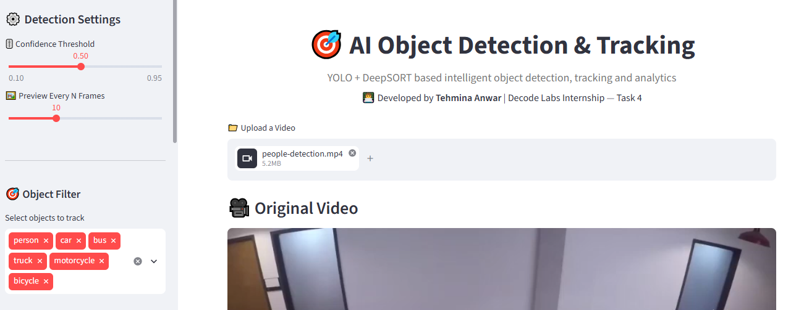
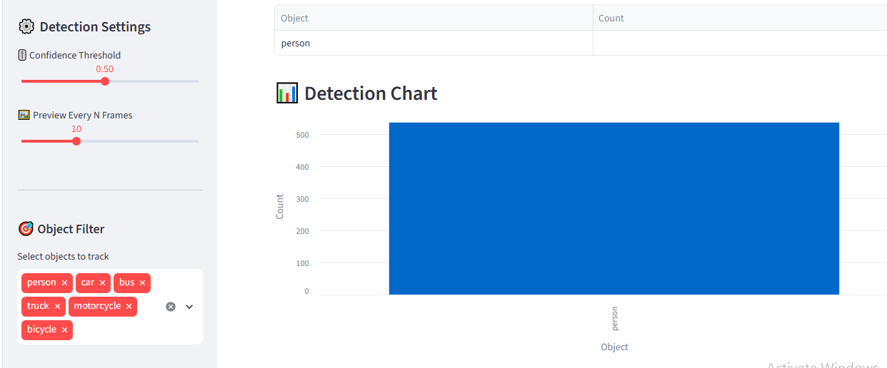
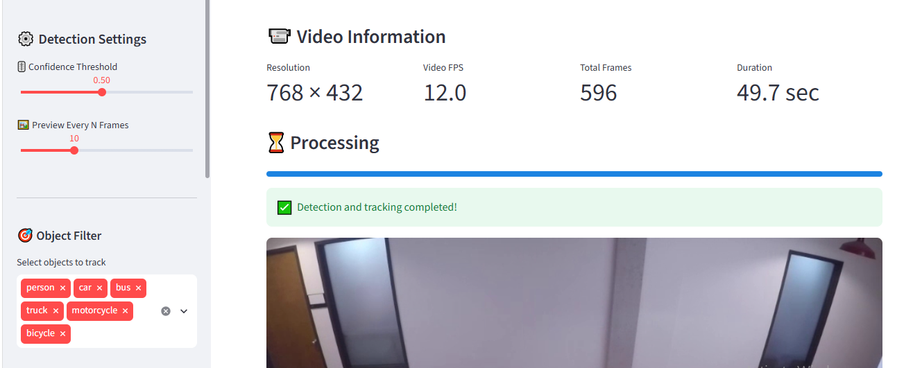
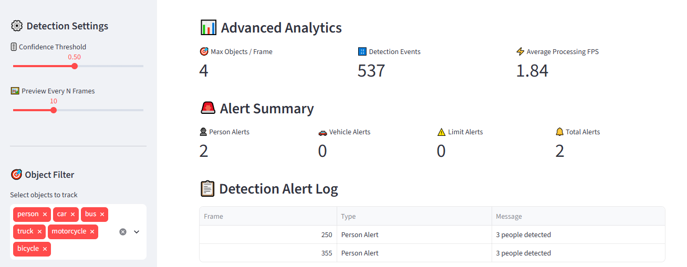

# 🎯 AI Object Detection & Tracking

<p align="center">
  
</p>

<p align="center">
  
  
  
  
  
</p>

<p align="center">
  <b>🤖 Intelligent Object Detection, Tracking & Video Analytics System</b>
</p>

<p align="center">
  Developed as part of the <b>DecodeLabs AI Internship — Task 4</b>
</p>

<p align="center">
  <a href="https://ai-object-detection-tracking-xoydqolhfxgcxmvefv45ac.streamlit.app/">
    🚀 <b>View Live Demo</b>
  </a>
</p>

---

## 📌 About the Project

**AI Object Detection & Tracking** is an intelligent Computer Vision application designed to detect, track, and analyze objects in uploaded videos.

The system combines **YOLO** for real-time object detection with **DeepSORT** for multi-object tracking. It processes videos frame-by-frame, assigns unique IDs to detected objects, tracks their movement, generates trajectories, monitors detection events, and provides detailed analytics.

The project is developed as an interactive **Streamlit web application**, allowing users to upload videos, customize detection settings, filter object classes, monitor tracking information, view analytics, and download the processed video.

### 🎓 Internship Project

**DecodeLabs AI Internship — Task 4**

---

## 🚀 Live Demo

<p align="center">
  <a href="https://ai-object-detection-tracking-xoydqolhfxgcxmvefv45ac.streamlit.app/">
    🔗 <b>Try AI Object Detection & Tracking Live</b>
  </a>
</p>

The application is deployed using **Streamlit Community Cloud**.

---

## ✨ Key Features

### 🤖 Object Detection & Tracking

* YOLO real-time object detection
* DeepSORT multi-object tracking
* Unique tracking ID assignment
* Person detection and tracking
* Vehicle detection and tracking
* Object class filtering
* Adjustable confidence threshold
* Bounding boxes and object labels

### 📍 Movement & Trajectory Analysis

* Track object movement across frames
* Store previous object positions
* Visualize movement trajectories
* Adjustable trajectory length
* Current and previous object positions
* Individual object tracking IDs

### 🚨 Alerts & Monitoring

* Live detection alerts
* Person detection alerts
* Vehicle detection alerts
* Configurable object-limit alerts
* Detection alert log
* Real-time monitoring during processing

### 📊 Analytics & Reports

* Current object statistics
* Unique object count
* Unique people count
* Unique vehicle count
* Detection count by class
* Maximum objects per frame
* Processing FPS
* Total processing time
* Detection charts
* Detailed tracking report

### 🎥 Video Processing

* Upload video files
* Frame-by-frame processing
* Original video preview
* Processed video preview
* Bounding boxes
* Object IDs
* Tracking trajectories
* Downloadable processed video

---

## 📁 Supported Video Formats

The application supports:

`MP4` • `AVI` • `MOV` • `MKV`

---

## 🧠 How It Works

```text
📁 Upload Video
       ↓
🎥 Read Video Frames
       ↓
🤖 YOLO Object Detection
       ↓
🎚️ Confidence Filtering
       ↓
🎯 Object Class Filtering
       ↓
🔍 DeepSORT Tracking
       ↓
🆔 Assign Unique Object IDs
       ↓
📍 Track Object Movement
       ↓
📊 Generate Live Statistics
       ↓
🚨 Generate Detection Alerts
       ↓
📈 Generate Analytics
       ↓
📋 Generate Tracking Report
       ↓
🎥 Create Processed Video
       ↓
⬇️ Download Result
```

---

## 🛠️ Technology Stack

| Technology                   | Purpose                              |
| ---------------------------- | ------------------------------------ |
| 🐍 Python 3.12               | Application development              |
| 🤖 YOLO                      | Real-time object detection           |
| 🔍 DeepSORT                  | Multi-object tracking                |
| 👁️ OpenCV                   | Computer vision and video processing |
| 🎈 Streamlit                 | Interactive web application          |
| 📊 Pandas                    | Data processing and analytics        |
| 🔢 NumPy                     | Numerical processing                 |
| 🐙 Git & GitHub              | Version control                      |
| ☁️ Streamlit Community Cloud | Application deployment               |

---

## 🎯 Supported Object Categories

The system can detect common object categories supported by the selected YOLO model, including:

* 👤 Person
* 🚗 Car
* 🚌 Bus
* 🚚 Truck
* 🏍️ Motorcycle
* 🚲 Bicycle
* 🐕 Dog
* 🐈 Cat
* 🐦 Bird

> The actual detected classes depend on the selected YOLO model and the uploaded video.

---

## 👤 People Detection

The system can detect and track people throughout the uploaded video.

For each confirmed person, the application can display:

* 👤 Person class
* 🆔 Unique tracking ID
* 📦 Bounding box
* 📍 Movement trajectory
* 🎯 Detection confidence
* 🚨 Detection alerts

The application also calculates the number of **unique people detected** during video processing.

---

## 🚗 Vehicle Detection

The application supports multiple vehicle categories, including:

* 🚗 Car
* 🚌 Bus
* 🚚 Truck
* 🏍️ Motorcycle
* 🚲 Bicycle

Vehicles receive unique tracking IDs and are included in the analytics and tracking reports.

---

## 📍 Object Tracking & Trajectories

DeepSORT helps maintain object identities across video frames.

The application stores previous object positions and uses them to visualize movement trajectories.

```text
🆔 Object ID
     ↓
📍 Current Position
     ↓
📍 Previous Position
     ↓
💾 Store Tracking Points
     ↓
📈 Draw Movement Trajectory
```

This allows users to understand how detected objects move through the scene.

---

## 🚨 Intelligent Alert System

The application includes an alert system that monitors detected objects during video processing.

Possible events include:

* 👤 Person detection
* 🚗 Vehicle detection
* ⚠️ Object-limit conditions
* 🔔 Detection events

The dashboard provides both:

* **Live Alerts**
* **Detection Alert Log**

---

## 📊 Live Statistics

During video processing, the dashboard displays real-time information such as:

| Statistic          | Description               |
| ------------------ | ------------------------- |
| 🎯 Current Objects | Objects currently visible |
| 👤 People          | Current people detected   |
| 🚗 Vehicles        | Current vehicles detected |
| ⚡ Processing FPS   | Current processing speed  |

---

## 📈 Final Analytics

After video processing, the application generates final analytics including:

* 🆔 Unique objects
* 👤 Unique people
* 🚗 Unique vehicles
* ⏱️ Processing time
* 🎯 Maximum objects per frame
* 🔢 Detection events
* ⚡ Average processing FPS
* 📊 Detection statistics

---

## 🎚️ Detection Settings

The Streamlit sidebar provides controls for customizing the detection process.

### Confidence Threshold

Users can select the minimum confidence required for a detection.

```text
0.10 ─────────────── 0.50 ─────────────── 0.95
```

A higher confidence threshold generally produces fewer but more confident detections.

### Preview Every N Frames

Controls how frequently processed frames are displayed in the Streamlit interface and can help reduce UI overhead.

### Object Filter

Users can select which object classes should be detected and tracked.

Example:

```text
☑ Person
☑ Car
☑ Bus
☑ Truck
☑ Motorcycle
☑ Bicycle
```

---

## 📹 Video Information

Before processing, the application displays information about the uploaded video, including:

* 📐 Resolution
* 🎞️ Video FPS
* 🎬 Total frames
* ⏱️ Duration

Example:

```text
Resolution: 768 × 432
Video FPS: 12.0
Total Frames: 596
Duration: 49.7 seconds
```

> Actual values depend on the uploaded video.

---

## 📄 Detailed Tracking Report

The application provides detailed tracking information that can include:

* 🆔 Object ID
* 🎯 Object class
* 🔢 Detection count
* 📍 Tracking information
* 🚨 Alert information
* ⏱️ Processing information

This makes the project useful for basic:

* Video surveillance
* Object monitoring
* Traffic monitoring
* Movement analysis
* Video analytics

---

# 📂 Project Structure

```text
AI-Object-Detection-Tracking/
│
├── app.py
├── requirements.txt
├── yolov8n.pt
├── AI OBJECT.png
├── README.md
├── .gitignore
│
└── Screenshots/
    ├── Home.PNG
    ├── Detaction.PNG
    ├── detection.png
    ├── analytics.PNG
    └── process video.PNG
```

---

# 📸 Screenshots

## 🏠 Home Page

<p align="center">
  
</p>

---

## 🎯 Object Detection

<p align="center">
  
</p>

---

## 📊 Detection Results

<p align="center">
  
</p>

---

## 📈 Analytics Dashboard

<p align="center">
  
</p>

---

## 🎥 Processed Video

<p align="center">
  
</p>

---

# 🚀 How to Run Locally

## 1️⃣ Clone the Repository

```bash
git clone https://github.com/Tehmina124/AI-Object-Detection-Tracking.git
```

## 2️⃣ Open the Project Folder

```bash
cd AI-Object-Detection-Tracking
```

## 3️⃣ Create a Virtual Environment

```bash
python -m venv venv
```

## 4️⃣ Activate the Virtual Environment

### Windows

```bash
venv\Scripts\activate
```

## 5️⃣ Install Dependencies

```bash
python -m pip install -r requirements.txt
```

## 6️⃣ Run the Streamlit Application

```bash
python -m streamlit run app.py
```

## 7️⃣ Open in Browser

```text
http://localhost:8501
```

---

# 📦 Required Dependencies

The project uses packages including:

```text
streamlit
opencv-python
ultralytics
deep-sort-realtime
numpy
pandas
```

All required dependencies are listed in:

```text
requirements.txt
```

---

# ☁️ Deployment

The application is deployed using **Streamlit Community Cloud**.

### Deployment Flow

```text
🐙 GitHub Repository
        ↓
📁 Project Files
        ↓
📄 requirements.txt
        ↓
🎈 Connect Repository to Streamlit
        ↓
▶️ Deploy Application
        ↓
🌐 Public Live Demo
```

### 🌐 Live Application

https://ai-object-detection-tracking-xoydqolhfxgcxmvefv45ac.streamlit.app/

---

# 🎯 Project Objectives

The main objectives of this project are:

* 🤖 Implement object detection
* 🔍 Implement multi-object tracking
* 🆔 Assign unique IDs to detected objects
* 👤 Detect and track people
* 🚗 Detect and track vehicles
* 📍 Visualize object trajectories
* 🚨 Generate detection alerts
* 📊 Generate real-time statistics
* 📈 Generate final analytics
* 🎥 Process uploaded videos
* ⬇️ Allow users to download processed videos
* 🎈 Build an interactive Streamlit application
* ☁️ Deploy an AI application online

---

# 💡 What I Learned

Through this project, I gained practical experience in:

* 🐍 Python development
* 👁️ Computer Vision
* 🤖 YOLO object detection
* 🔍 DeepSORT object tracking
* 🎥 Video processing
* 📦 Bounding-box processing
* 🆔 Object identity tracking
* 📍 Trajectory visualization
* 🚨 Alert generation
* 📊 Data analytics
* 🎈 Streamlit development
* 🐙 Git & GitHub
* ☁️ Streamlit Cloud deployment

---

# 🔮 Future Improvements

Potential future improvements include:

* 🧠 Custom-trained YOLO models
* 🎯 Higher-accuracy detection
* 👥 Advanced crowd analysis
* 🚨 Real-time notification system
* 📧 Email alerts
* 📱 Mobile notifications
* 🔊 Audio alerts
* 📷 Live camera support
* 🌐 IP camera / CCTV integration
* 🧠 Advanced behavior detection
* 🚶 Person re-identification
* 🚗 License plate detection
* 📊 CSV/PDF analytics export
* 🗺️ Advanced tracking visualization
* ⚡ GPU-accelerated processing
* 🔐 User authentication

---

# ⭐ Project Highlights

| Feature                | Description                     |
| ---------------------- | ------------------------------- |
| 🤖 YOLO Detection      | Detect objects in video frames  |
| 🔍 DeepSORT Tracking   | Track objects across frames     |
| 🆔 Unique IDs          | Maintain object identities      |
| 👤 People Detection    | Detect and count people         |
| 🚗 Vehicle Detection   | Detect multiple vehicle types   |
| 📍 Trajectories        | Visualize object movement       |
| 🚨 Alerts              | Generate detection alerts       |
| 📊 Live Statistics     | Monitor processing in real time |
| 📈 Analytics           | Generate final statistics       |
| 📋 Tracking Report     | Summarize tracking information  |
| 🎚️ Confidence Control | Adjust detection sensitivity    |
| 🎯 Object Filtering    | Select object classes           |
| 🎥 Video Processing    | Generate processed videos       |
| ⬇️ Download            | Download processed results      |
| ☁️ Cloud Deployment    | Public Streamlit application    |

---

# 🎓 Internship Information

**Program:** DecodeLabs AI Internship
**Task:** Task 4
**Project:** AI Object Detection & Tracking
**Domain:** Artificial Intelligence / Computer Vision

---

# 👩‍💻 About Me

## Tehmina Anwar

**BSAI Student | AI/ML Engineer | Python Developer**

I am a Bachelor of Science in Artificial Intelligence student interested in building practical and intelligent applications using Artificial Intelligence, Machine Learning, Generative AI, Natural Language Processing, and Computer Vision.

### 🌟 Areas of Interest

* 🐍 Python
* 🤖 Machine Learning
* 🧠 Generative AI
* 💬 Large Language Models
* 🔎 Retrieval-Augmented Generation
* 📝 Natural Language Processing
* 👁️ Computer Vision
* 🚀 AI Application Development

---

# 🔗 Connect With Me

<p align="center">
  <a href="https://github.com/Tehmina124">💻 GitHub</a> •
  <a href="https://www.linkedin.com/in/tehmina-anwar-77b8a8414/">🔗 LinkedIn</a> •
  <a href="https://tehmina-portfolio-five.vercel.app/">🌐 Portfolio</a> •
  <a href="https://ai-object-detection-tracking-xoydqolhfxgcxmvefv45ac.streamlit.app/">🚀 Live Project</a>
</p>

---

# ⭐ Support

If you found this project useful or interesting, consider giving the repository a ⭐ **Star** on GitHub.

Your support is greatly appreciated! ❤️

<p align="center">
  <b>🎯 Built with ❤️ using Python, YOLO, DeepSORT, OpenCV & Streamlit</b>
</p>

<p align="center">
  © 2026 <b>Tehmina Anwar</b> | DecodeLabs AI Internship | Task 4
</p>
